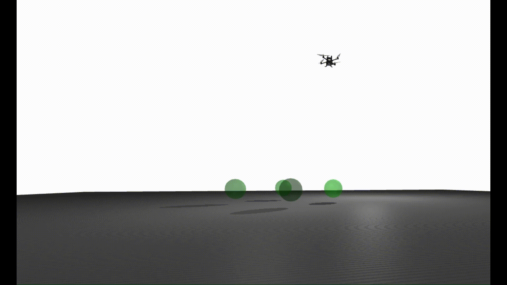

# Quadrotor-PD-Controller-Dojo [1]
Implementation of a PID Feedback controller for quadrotor drone stabilization and navigation in the Dojo simulation environment, written in Julia. This project demonstrates how classical control techniques can be implemented into simulation frameworks, enabling position and attitude control of quadrotor

## Dojo-Simulation-Environment

This project uses [**Dojo.jl**](https://dojo-sim.github.io/Dojo.jl/dev/), a differentiable simulator for robotics in Julia designed for robotics and reinforcement learning research. Dojo provides realistic rigid-body dynamics, contact modeling, and customizable environments, making it ideal for drone control experiments.

For environment initialization, setup details, and further instructions, please refer to the official [Dojo documentation](https://dojo-sim.github.io/Dojo.jl/dev/)

## Navigation
The following video demonstrates the PD controller driving the quadrotor toward a desired point in the Dojo simulation environment, maintaining stability throughout the maneuver.

## Stabilization
The robustness of the PD controller is illustrated in the looping animation below. The quadrotor is disturbed from its equilibrium point but, returning to the desired point and maintaining stability despite looping manoeuvre.

## References

[1] Howell, T., Le Cleac’h, S., Bruedigam, J., Kolter, Z., Schwager, M., & Manchester, Z. (2022).  
  **Dojo: A Differentiable Simulator for Robotics**. *arXiv preprint arXiv:2203.00806*.  
  [https://arxiv.org/abs/2203.00806](https://arxiv.org/abs/2203.00806)
