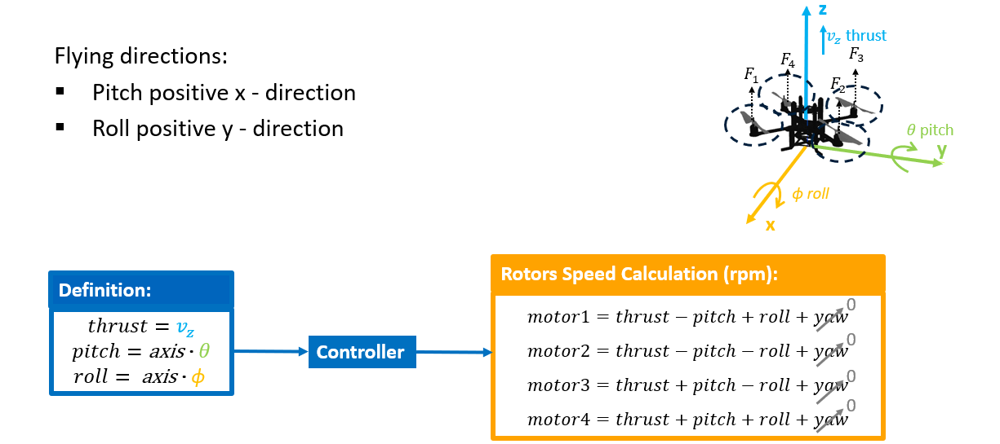
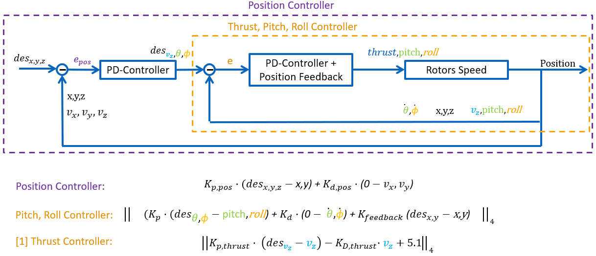

# Quadrotor-PD-Controller-Dojo [1]
Implementation of a PID Feedback controller for quadrotor drone stabilization and navigation in the Dojo simulation environment, written in Julia. This project demonstrates how classical control techniques can be implemented into simulation frameworks, enabling position and attitude control of quadrotor

## Dojo-Simulation-Environment

This project uses [**Dojo.jl**](https://dojo-sim.github.io/Dojo.jl/dev/), a differentiable simulator for robotics in Julia designed for robotics and reinforcement learning research. Dojo provides realistic rigid-body dynamics, contact modeling, and customizable environments, making it ideal for drone control experiments.

For environment initialization, setup details, and further instructions, please refer to the official [Dojo documentation](https://dojo-sim.github.io/Dojo.jl/dev/)

## Navigation
The following video demonstrates the PD controller driving the quadrotor toward a desired point in the Dojo simulation environment, maintaining stability throughout the maneuver.


## Stabilization
The robustness of the PD controller is illustrated in the looping animation below. The quadrotor is disturbed from its equilibrium point but, returning to the desired point and maintaining stability despite looping manoeuvre.


## Control

The quadrotor control system converts high-level commands (desired thrust, pitch, and roll) into individual motor speeds required for stable flight.

- **Flying directions**:  
  - Pitch corresponds to rotation around the **x-axis** (positive forward).  
  - Roll corresponds to rotation around the **y-axis** (positive to the right).  

- **Definitions**:  
  - `thrust = v_z` (vertical velocity or lift command)  
  - `pitch = axis · θ` (commanded pitch angle)  
  - `roll = axis · φ` (commanded roll angle)

These control inputs are processed by the controller to compute rotor speeds (in rpm) as follows:
```
motor1 = thrust − pitch + roll + yaw
motor2 = thrust − pitch − roll + yaw
motor3 = thrust + pitch − roll + yaw
motor4 = thrust + pitch + roll − yaw
```
The diagram below visualizes the relationship between thrust, pitch, roll, and individual rotor forces:



## PD-Control Architecture

The PD control system is organized in two main stages:

1. **Position Controller (Outer Loop)**  
   - Takes the desired position `des_{x,y,z}` and compares it with the current position.  
   - Computes position error `e_pos` and outputs desired thrust and attitude angles (`des_{v_z}, θ, φ`).  

2. **Thrust, Pitch, Roll Controller (Inner Loop)**  
   - Takes the desired thrust and angles and compares them with the actual measured values.  
   - Computes control signals for motor speeds using PD control with feedback on angular velocities and position.  

The outputs of these controllers are combined into **rotor speed commands** which drive the drone’s motors.



## Results

### Position desired [1 1 1]


### Error measurement desired Point [1 1 1]


## References

[1] Howell, T., Le Cleac’h, S., Bruedigam, J., Kolter, Z., Schwager, M., & Manchester, Z. (2022).  
  **Dojo: A Differentiable Simulator for Robotics**. *arXiv preprint arXiv:2203.00806*.  
  [https://arxiv.org/abs/2203.00806](https://arxiv.org/abs/2203.00806)
